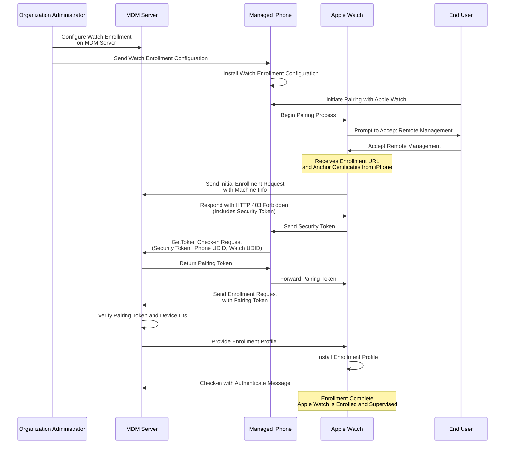
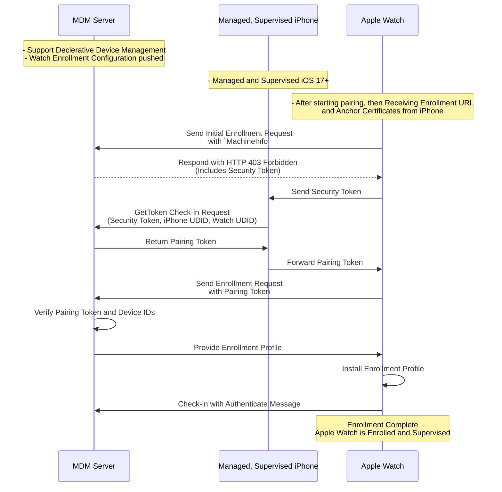

## Apple Watch Enrollment

### Introduction

### Prerequisites

### Enrollment Flow 

### 

### Sequence Diagram

- Shorter one:

### Post-Enrollment Considerations

### Security Considerations

### Troubleshooting

### Declarations and Requests Schemas:

- [Watch Enrollment Configuration Declaration](https://github.com/apple/device-management/blob/release/declarative/declarations/configurations/watch.enrollment.yaml)
- [MachineInfo request Schema](https://github.com/apple/device-management/blob/release/other/machineinfo.yaml)
- [GetTocken MDM Schema](https://github.com/apple/device-management/blob/release/mdm/checkin/gettoken.yaml)
-  

### References

- Check the following video for full details on [Apple Watch Enrollment](https://developer.apple.com/videos/play/wwdc2023/10039/).
