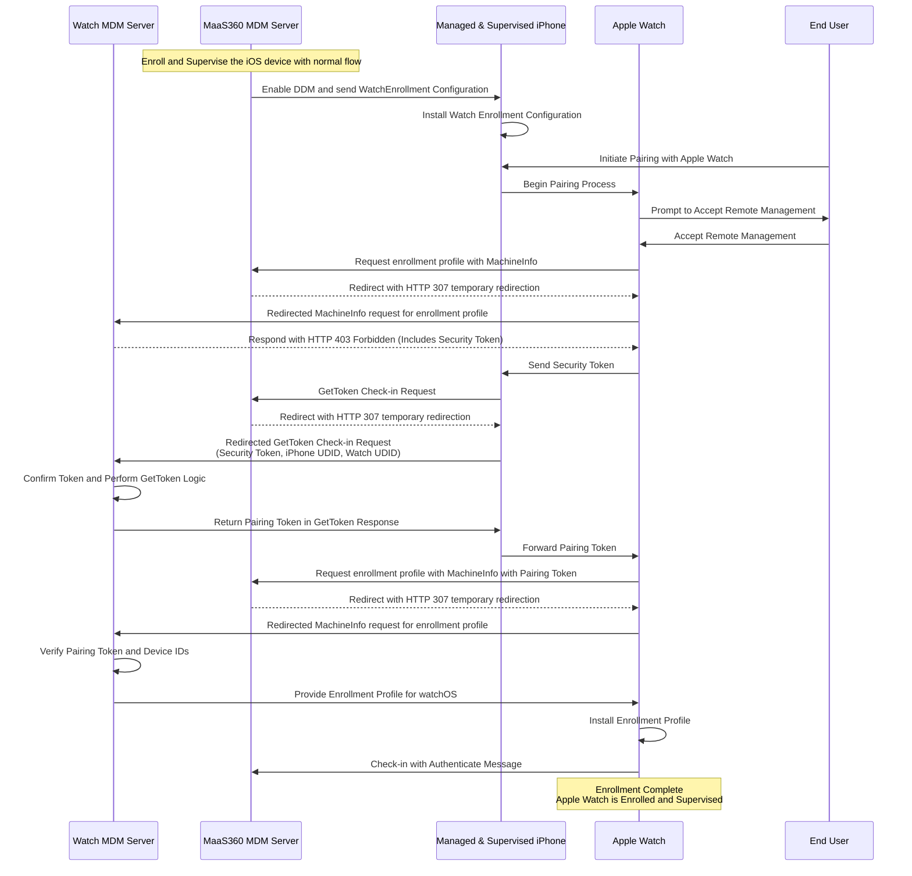

# Apple WatchOS Enrollment Flow



## Initial Setup

- The iOS device must eroll and supervised with Maas360 MDM server.

- Use the workflow for converting non-DEP to DEP with apple configurator and Apple Business Manager.

- Confirm that the device is enrolled and supervised.

- Make sure the Enrollment Profile for Apple Watch is ready.

- To support `GetToken` check-in request, include the service type `com.apple.watch.pairing` in the `ServerCapabilities` key of the MDM profile payload.


## Declairation for activating WatchEnrollment Configuration

- Enable Declartive Device Management (DDM) for the supervised iOS device.

- Send the WatchEnrollment Configuration to the iOS device, and make sure to install it.

- Here is an example of the WatchEnrollment Configuration:

```json
// Apple Watch Enrollment Configuration example
{
  "Type" : "com.apple.configuration.watch.enrollmenet",
  "Identifier": "F7822272-F248-48D6-8858-8F92341C27AC",
  "ServerToken": "536722E8-042B-4462-A6D1-2B6813C29507",
  "Payload": {
    "Enrollment ProfileURL": "https://example.com/enroll",
    "AnchorCertificateAssetReferences": [
      "91D3512C-5E44-4C6F-97A5-59A8F731641D"
    ]
  }
}
```

- for `Enrollment ProfileURL` insert the URL where the Enrollment Profile can be installed.

- That endpoint should response with 307 temporary redirection to the WatchOS MDM Server.

- The Server is hosted on Heroku with the URL `https://apple-mdm-f41af102f31d.herokuapp.com/` and the endpoint is `/watchos/enroll`.

<!-- - for full schema check [here](https://github.com/apple/device-management/blob/release/declarative/declarations/configurations/watch.enrollment.yaml)
and for docs [here](https://developer.apple.com/documentation/devicemanagement/watchenrollment)

- `AnchorCertificateAssetReferences` is optional and its an asset reference of the type `com.apple.asset.credential.certificate`, it should be a list.
For more info about this asset [check the schema here](https://github.com/apple/device-management/blob/release/declarative/declarations/assets/credential.certificate.yaml)

- The `Enrollment ProfileURL` is the URL to the Apple Watch Enrollment profile with MDM Payload, the schema for MDM payload can
be found [here](https://github.com/apple/device-management/blob/release/mdm/profiles/com.apple.mdm.yaml) -->

## Handling MachineInfo Request without/with Pairing Token key

- Apple Watch will send a `POST` request to the `Enrollment ProfileURL` with the `MachineInfo` payload.

- The MaaS360 MDM Server will respond with a `307 Temporary Redirection` to the WatchOS MDM Server.

- The WatchOS MDM Server will check for `PAIRING_TOKEN` key in the `MachineInfo` payload that is in `Content-Type: application/pkcs7-signature`.
	- If the `PAIRING_TOKEN` key is missing, the WatchOS MDM Server will respond with a `403 Forbidden` error with a `security-token` key in the response body.
	- If the `PAIRING_TOKEN` key is present, the WatchOS MDM Server will proceed with the enrollment process, and will send the Enrollment Profile to the Apple Watch.


## Enrollment Request with `machineinfo`

Scehma can be found [here](https://github.com/apple/device-management/blob/release/other/machineinfo.yaml) and for docs [here](https://developer.apple.com/documentation/devicemanagement/machineinfo)

- MachineInfo is a payload sent by a client when fetching and MDM Enrollment profile.
- Here is an example of machineinfo request, the URL is the Enrollment URL from the Configuration, and the body can be as follow:
```xml
<!-- example of a machineinfo request body -->
<dict>
  <key>IMEI</key>
  <string>35 843027 813842 2</string>
  <key>LANGUAGE</key>
  <string>en-US</string>
  <key>OS_VERSION</key>
  <string>10.0</string>
  <key>PRODUCT</key>
  <string>Watch6, 13</string>
  <key>SERIAL</key>
  <string>QVD7Y59Q</string>
  <key>UDID</key>
  <string>00003801-60946C02E</string>
  <key>VERSION</key>
  <string>21R269</string>
  <key>PAIRING_TOKEN</key> 
  <data>VGVzdCBTdHJpbmcK</data> 
</dict>
```
- Here is the current Headers of the request received from the apple device:
```text
Request Received
host  :  36a1-129-41-58-6.ngrok-free.app
user-agent  :  CloudConfiguration/1.0
content-length  :  3762
accept  :  */*
accept-encoding  :  gzip, deflate, br
accept-language  :  en-IN,en-US;q=0.9,en;q=0.8
content-type  :  application/pkcs7-signature
x-forwarded-for  :  2409:40f2:2f:9f74:6da3:424d:2da0:6d4b
x-forwarded-host  :  36a1-129-41-58-6.ngrok-free.app
x-forwarded-proto  :  https
```

## 403 Response with Security token

Here is Missing Pairing Error Object from [docs](https://developer.apple.com/documentation/devicemanagement/errorcodepairingtokenmissing)

- The MDM server will check the existance of `PAIRING_TOKEN`, if not then return 403 Response with a security-token just like this (can be xml or json) :
```json
// HTTP 403 error response
{
  "code": "com.apple.watch.pairing.token.missing",
  "details": {
    "security-token": "ABC-123"
  }
}
```

## GetToken Checkin Request implementation

The schema for this request is [here](https://github.com/apple/device-management/blob/release/mdm/checkin/gettoken.yaml) and for docs is [here](https://developer.apple.com/documentation/devicemanagement/get_token)

- Include for the service type com.apple.watch.pairing value in the ServerCapabilities key of the MDM profile payload to enroll the device.
- The purpose of this token is to confirm the pairing relationship of the watch to the phone
- Check Security-token to confirme the user
- Here is an example of GetToken Request Body:
```xml
// GetToken request
<dict>
<key>MessageType</key>
<string>GetToken</string>
<key>TokenServiceType</key>
<string>com.apple.watch.pairing</string>
<key>TokenParameters</key>
<dict>
<key>SecurityToken</key> <string>ABC-123</string>
<key>PhoneUDID</key>
<string>12345</string>
<key> WatchUDID </key>
<string>ABC-123</string>
</dict>
</dict>
```
- On success, the MDM server will return a pairing token that can be used by the watch to get the profile. Here is how a response can be:
```xml
// GetToken response
<dict>
  <key>TokenData</key> <data>VGVzdCBTdHJpbmcK</data> // base64 "Test String"
</dict>
```
- `phone and watch MDM servers` need to use the same format for token.
- The WatchOS MDM Server has to verify the `SecurityToken` and the `PhoneUDID` and `WatchUDID` before returning the pairing token.

## Apple Watch Enrollment Profile

**Use the same profile for IOS devices**

- To support `GetToken` check-in request, include the service type `com.apple.watch.pairing` in the `ServerCapabilities` key of the MDM profile payload.

Here is an example of an MDM profile for Enrollment:
```xml
<?xml version=”1.0” encoding=”UTF-8”?>
<!DOCTYPE plist PUBLIC “-//Apple//DTD PLIST 1.0//EN” “http://www.apple.com/DTDs/PropertyList-1.0.dtd”>
<plist version=”1.0”>
<dict>
    <key>PayloadContent</key>
    <array>
        <dict>
            <key>PayloadContent</key>
            <data>
            LS0tLS1CRUdJTiBDRVJUSUZJQ0FURS0tLS0tCk1JSUZlRENDQTJB
            Q0NRQzFsWFV5WnJPbERqQU5CZ2txaGtpRzl3MEJBUXNGQURCK01R
            c3dDUVlEVlFRR0V3SlYKVXpFVE1CRUdBMVVFQ0F3S1EyRnNhV1p2
            Y201cFlURVNNQkFHQTFVRUJ3d0pRM1Z3WlhKMGFXNXZNUk13RVFZ
            RApWUVFLREFwQmNIQnNaU0JKYm1NdU1Sb3dHQVlEVlFRTERCRkVa
            WFpwWTJVZ1RXRnVZV2RsYldWdWRERVZNQk1HCkExVUVBd3dNVFVN
            Z1VtOXZkQ0JEWlhKME1CNFhEVEU1TURVd01UQTNNVFF6TVZvWERU
            STVNRFF5T0RBM01UUXoKTVZvd2ZqRUxNQWtHQTFVRUJoTUNWVk14
            RXpBUkJnTlZCQWdNQ2tOaGJHbG1iM0p1YVdFeEVqQVFCZ05WQkFj
            TQpDVU4xY0dWeWRHbHViekVUTUJFR0ExVUVDZ3dLUVhCd2JHVWdT
            VzVqTGpFYU1CZ0dBMVVFQ3d3UlJHVjJhV05sCklFMWhibUZuWlcx
            bGJuUXhGVEFUQmdOVkJBTU1ERTFESUZKdmIzUWdRMlZ5ZERDQ0Fp
            SXdEUVlKS29aSWh2Y04KQVFFQkJRQURnZ0lQQURDQ0Fnb0NnZ0lC
            QUpZVUFISWErRHI1Q0JzeEQ5NjJTRTc1WG50UzNmTEYyRGJIdHFT
            YwpwdXpsRVhEeC8yaXNVWHVKVkhYdlNkWkx3YmpFRFJKMTF5WlNv
            SzFTMTJVOFVUS1VsK2JHUS9HbjcxVkJnblY2CmFxYmRWVzRFOGxJ
            bU1rN2paRE1IMW14a3cxOWZHdEREaEVOMTA1R3g3K2RVbkpzMTdz
            NHAramJIUThwbzNIY2sKNG5VejgyVTZKUmJXdU5SZFNxNWIvaDNT
            VzlBM2laMXRPRHlNbExOK1ZyaHREYkxhRS9URlk1eFovdjRiUmZ2
            RQpGSjYvVVQ2bGc3RVorcjBYdnljV0tvMnZUL2ZPdUVHbU5CczFy
            YmNPZ3dpQlZEUjdXRG5Pb3RUVkHtMUxydFZFCmFtVlljUHdxSjlu
            Y01hSk14Y01JNHZDazR4eFBwNy9jeEJzcGQwK2diR1lYSVlkYnI5
            YlM2Q1RhMHkzTmIxeCsKdnJZN1RTWFBHSFRNQzAvYXBQQ21CRjBy
            RFdzNm1ZcytFKzRQaENLaDUyeFRROHp5WjVRNk5yOVhqUVJKajl2
            YgpKa2pMMTY1NnJwVFBFV21CUzJxQ1ZqTUxpbFA4MGE1MDVkd0kx
            YzZwa1NrUDczMGtIaExtQ1R4ZkJwb1Jid1p5CjFrQk1qM2xhWkE5
            Y21UUlFiT1pQMkYzNVVudmw1LzFuNG5Wd0N4R1Mzc2U1NWxudzh3
            SzUvRmtBYXptS1dDdzAKTnZjRUc5T0FtQUIrNWpaVVdNZXdoenFy
            TWdMUDFQbm1qR0twemN0dG8vTmxQZE91QVhnZ1A0ZjlPaVkyNlV4
            UwpHcW55R2hXamlIbTZIeXkvMWNuNXRYZVNMcVZISzZoaXJINk1o
            eks4K0R5Rkg2N0R3dmIyTnRKUkhadUhTb0FXClRwS2ZBZ01CQUFF
            d0RRWUpLb1pJaHZjTkFSSUxCUUFEZ2dJQkFHVWl4VDEwaW5KcVVq
            b0NtTWpHNlJwL1hGRUgKZzZoQml6OFUveVJWUEhvMG9RNFREdnIw
            WDBFOXk3Lyt3YXc5clpIRTdqd1VOendtWXZFeWwwMzZCcFQyVVZB
            aQpvWDAyMDZqcmVXSk9nTVYxbFlBVWhYZTY1eml2ak9WRE9rVFFX
            aUZKb3pjbXYwdXZabmsrRWl4eFByUEJYOThOClhRNEF5VWt5S25n
            WTVHSnlPbW5iK3ZnUlFCM25yTXpJbXIyekxNUlp2b21DT1pEV0FK
            ZGF3UlNZTXBFOGZreVAKZnY3QzVWOXdLVllxVFJNd1FEbk1YL1g5
            eUFUTXV0QWV0MTV3N2taN3JYenc4ZFxjZFBwMlBSQkJIem1kWWF3
            egpmbFdWT2dBKzdHSTcwVkVtNER6UkxCVmJjaUcyZU1mVEtYemZX
            eGcrbHhQaWxacy82T2Y1aG9jdVRWeVhEeHJnCkUwRDZLbFVSK2k0
            N3ovZDRTaWsrSVdJRkx3Y21XOEhFelEyVzlTakFwSDRTaGhEKzBz
            UXQ2bzZMNjA0cjBqTzEKbUhYbkhxSmNGRmVaYjlONzJrMElNZTJv
            MForaXd1YmJYamZQZzlMV1EzamVJOVJPZkJzWlA1ZkE1MkxiRlB5
            UgpiSkxOODl4cm5DeEt2TzVsUHp2WHpwYXlrRUNWRG1Oa0lZMlRO
            WG4yUnVmQVdDYXpFVWlLd2lPQ1JLZjJSTHBPCmZUb25IYVdIZi9B
            NzBqWTJXb1JGQ3laV1BnQ3U2QW1kMFNNK3p2cm1NQi9SLzZBYlQv
            WDFjckFQR1ArNkVzU0YKeHBkRHJqZUdLYWlYM3l0UmVBSnFFMEFQ
            YWt4OENXR2haMkVVOUlnY3loNTE2bGY4OXlUcTBEbGlCUjNDWVJl
            bgpsMGJhMSt6M1J6VlZhRWgvCi0tLS0tRU5EIENFUlRJRklDQVRF
            LS0tLS0K
            </data>
            <key>PayloadIdentifier</key>
            <string>com.example.mypempayload</string>
            <key>PayloadType</key>
            <string>com.apple.security.pem</string>
            <key>PayloadUUID</key>
            <string>0dfe81fe-e8f6-45c0-9860-2c893fe30114</string>
            <key>PayloadVersion</key>
            <integer>1</integer>
        </dict>
        <dict>
            <key>PayloadContent</key>
            <dict>
                <key>URL</key>
                <string>https://mdm.example.com:2002/scep</string>
                <key>Key Type</key>
                <string>RSA</string>
                <key>Key Usage</key>
                <integer>5</integer>
                <key>Keysize</key>
                <integer>2048</integer>
                <key>Subject</key>
                <array>
                    <array>
                        <array>
                            <string>O</string>
                            <string>Example, Inc.</string>
                        </array>
                    </array>
                    <array>
                        <array>
                            <string>CN</string>
                            <string>Device Certificate</string>
                        </array>
                    </array>
                </array>
                <key>Challenge</key>
                <string>MDMEnrollment</string>
            </dict>         
            <key>PayloadIdentifier</key>
            <string>com.example.mysceppayload</string>
            <key>PayloadType</key>
            <string>com.apple.security.scep</string>
            <key>PayloadUUID</key>
            <string>47492623-e4e7-4a64-ba63-2f31d2ca1a5f</string>
            <key>PayloadVersion</key>
            <integer>1</integer>
        </dict>
        <dict>
            <key>IdentityCertificateUUID</key>
            <string>47492623-e4e7-4a64-ba63-2f31d2ca1a5f</string>
            <key>ServerURL</key>
            <string>https://mdm.example.com:2001/mdm</string>
            <key>Topic</key>
            <string>com.apple.mgmt.External.c809ab17-1cbd-48f2-8dc7-e952131df20c</string>
            <key>AccessRights</key>
            <integer>8191</integer>
            <key>ServerCapabilities</key>
            <array>
				<string>com.apple.mdm.token</string>
                <string>com.apple.mdm.per-user-connections</string>
                <string>com.apple.mdm.bootstraptoken</string>
            </array>
            <key>CheckInURL</key>
            <string>https://mdm.example.com:2001/checkin</string>
            <key>CheckOutWhenRemoved</key>
            <true/>
            <key>PromptUserToAllowBootstrapTokenForAuthentication</key>
            <false/>
            <key>PayloadIdentifier</key>
            <string>com.example.mymdmpayload</string>
            <key>PayloadType</key>
            <string>com.apple.mdm</string>
            <key>PayloadUUID</key>
            <string>0ae4af50-590a-4478-b540-aa0a21da23f1</string>
            <key>PayloadVersion</key>
            <integer>1</integer>
        </dict>
    </array>
    <key>PayloadDisplayName</key>
    <string>MDM</string>
    <key>PayloadIdentifier</key>
    <string>com.example.myprofile</string>
    <key>PayloadType</key>
    <string>Configuration</string>
    <key>PayloadUUID</key>
    <string>1f4ef23b-ab01-45b9-879c-7a036e47b083</string>
    <key>PayloadVersion</key>
    <integer>1</integer>
</dict>
</plist>
```